# Embedding Console

A .NET 10 console application that transforms markdown documentation into searchable vector embeddings via a two-stage pipeline: agentic RAG chunking followed by embedding generation and Qdrant database loading.

## What This Project Does

Given any set of markdown files, this tool produces semantically-enriched chunks ready for retrieval-augmented generation (RAG). The pipeline breaks documents into meaningful segments, analyzes them with an LLM for keywords/entities/concepts, then converts each chunk into embedding vectors and loads them into Qdrant for similarity search.

### Pipeline Overview

[](Docs/assets/embedding-console-flow.svg)

> **Interactive version:** [View the full-resolution diagram](Docs/assets/embedding-console-flow.svg) — [Mermaid source](Docs/assets/embedding-console-flow.mmd)

## Requirements

| Component | Purpose | Details |
|-----------|---------|---------|
| [.NET 10 SDK](https://dotnet.microsoft.com/download) | Runtime and build | `dotnet --version` ≥ 10.0.0 |
| [llama.cpp server](https://github.com/ggml-org/llama.cpp) | Embedding model inference | HTTP endpoint with `/v1/embeddings` support |
| Python 3 + `qdrant-client` | Qdrant collection setup and upsert | Install via `pip install qdrant-client` |
| Running Qdrant instance | Vector database | Default: `http://localhost:6333` |

## Quick Start

### 1. Build

```bash
dotnet build "Embedding Console.csproj"
```

### 2. Run the RAG Pipeline

This chunks your markdown documents into semantically-analyzed, retrieval-ready pieces:

```bash
# Process a single file
dotnet run -- rag input.md

# Process multiple files to an output directory
dotnet run -- rag doc1.md doc2.md -o ./rag_output

# Scan a directory for all .md files (recursive)
dotnet run -- rag --input-dir ./docs -o ./rag_output

# With custom llama.cpp URL and longer timeout for large docs
dotnet run -- rag --llama-url http://localhost:4000 -o ./rag_output --timeout 20
```

**Output:** `<filename>.ragged.json` for each input file, containing segmented chunks with full metadata (topics, keywords, entities, technologies, concepts, retrieval queries). Per-file debug logs are written to `<filename>_pipeline.log.txt`.

### 3. Generate Embeddings

Convert ragged JSON into vector-embedded files:

```bash
# Single file
dotnet run -- embed input.ragged.json

# Batch mode (merges all inputs into one output)
dotnet run -- embed file1.ragged.json file2.ragged.json -o ./output/

# Directory scan (all .json files in DIR are processed and merged)
dotnet run -- embed --input-dir ./rag_output -o ./output/
```

**Output:** `embedded.json` with a `chunks` array containing vector payloads ready for Qdrant, plus metadata (`total_chunks`, `source_files`, `successful_chunks`). Failed files produce `<basename>.embed_errors.json`.

### 4. Load into Qdrant

```bash
# Create collection (auto-detects embedding dimension from llama.cpp)
python3 setup_qdrant.py create --llama-url http://localhost:4000

# Upsert embedded chunks
python3 setup_qdrant.py upsert -j ./output/embedded.json
```

## Environment Variables

| Variable | Default | Purpose |
|----------|---------|---------|
| `LLAMA_CPP_URL` | `http://localhost:4000` | llama.cpp server endpoint (both embed and rag) |
| `LLAMA_CPP_MODEL` | _(none)_ | Model ID string, shown in output logs |
| `EMBEDDING_DIMENSION` | `0` (auto-detect) | Expected vector dimension; set to avoid first-chunk mismatch errors |

## Full Command Reference

### Main CLI

```bash
dotnet run -- <command> [options]
```

Available commands: `embed`, `rag`. Use `--help` or `-h` for usage details.

### Embed Subcommand

```bash
# Single file (legacy mode)
dotnet run -- embed input.json [output.json]

# Batch mode — merges all inputs into a single embedded.json
dotnet run -- embed file1.json file2.json -o ./output/

# Directory scan mode
dotnet run -- embed --input-dir DIR -o ./output/
```

| Option | Description |
|--------|-------------|
| `--input-dir, -d DIR` | Scan directory recursively for `*.json` files |
| `--output-dir, -o DIR` | Output directory (default: current directory) |

### RAG Subcommand

```bash
dotnet run -- rag [file1.md ...] [options]
```

| Option | Description | Default |
|--------|-------------|---------|
| `--input-dir, -d DIR` | Scan for `.md`/`.markdown` files recursively | _(none)_ |
| `--output-dir, -o DIR` | Output directory for `.ragged.json` files | `./rag_output` |
| `--llama-url, -l URL` | llama.cpp server URL | `$LLAMA_CPP_URL` or `http://localhost:4000` |
| `--prompt-dir, -p DIR` | Directory with prompt templates | `./Prompts` |
| `--timeout MIN` | Per-stage timeout (minutes) for LLM calls | `10` |

**Note:** Each stage resets context to avoid LLM rot. Large files may need `--timeout 20` or higher. Total wall-clock time ≈ timeout × stages × batches.

### Python Setup Script

```bash
# Create collection with auto-detection
python3 setup_qdrant.py create --llama-url http://localhost:4000

# Or with manual dimension specification
python3 setup_qdrant.py create --dimension 4096

# Upsert from embedded output
python3 setup_qdrant.py upsert -j ./output/embedded.json
```

**Global options:** `--collection NAME` (default: `"Coding Knowledge"`), `--qdrant-url URL`.

## Project Structure

```
Embedding Console.csproj        # .NET 10 project
Program.cs                      # CLI entry: arg parsing → routing → processors
Prompts/prompts.json            # Embedded prompt templates (assembly resource)
Prompts/[RAG] 01 Segment.md     # Stage 1: Document segmentation prompt
Prompts/[RAG] 02 Semantic.md    # Stage 2: Semantic extraction prompt
Prompts/[RAG] 03 Chunking.md    # Stage 3: RAG chunking prompt
Prompts/[DEV] Initial Prompt.md # Original spec document

Processors/
  AgenticChunkingProcessor.cs   # RAG pipeline orchestrator (3-stage)
  EmbeddingProcessor.cs         # ETL: extract chunks → embed → build Qdrant points

Services/
  IEmbeddingService.cs          # Interface for embedding backends
  LlamaCppEmbeddingService.cs   # HTTP client against llama.cpp
  FakeEmbeddingService.cs       # Deterministic hash vectors (for tests)
  RagService.cs                 # RAG LLM client with timeout wrapper

Models/
  QdrantPoint.cs                # Record(Id, Vector, Payload)

Utils/
  BatchEmbedHelpers.cs          # Batch orchestrator chunk extraction
  HelpText.cs                   # CLI --help text constants
  PipelineLogger.cs             # Structured debug logging for RAG pipeline

Tests/                          # Inline test harness (dotnet run)
setup_qdrant.py                 # Qdrant collection + batch upsert
Samples/                        # Complete pipeline examples
```

## Sample Output: Chunk Structure

Each chunk in the ragged/embedded output includes rich metadata:

**Chunk structure:**
```jsonc
{
  "id": "seg0-001",                              // Globally unique segment-chunk ID
  "content": "Verbatim source markdown text...",  // Content for embedding
  "retrieval_content": "Title » Path — topic... ",// Search context
  "metadata": {                                    // Structured metadata
    "source_file": "config/build-options.md",     // Origin document
    "document_title": "Build Options",            // Title
    "section": "build.target",                    // Section path
    "heading_path": ["Build Options", "build.target"],
    "topic": "Browser compatibility targeting",   // Topic summary
    "summary": "One-liner description...",
    "keywords": ["build.target", "browser compatibility", ...],
    "entities": ["Vite", "Oxc Transformer", ...], // Named entities
    "technologies": ["Vite", "Oxc"],              // Relevant tech stack
    "concepts": ["ES version lowering", ...],     // Abstract concepts
    "retrieval_queries": [                        // Natural language queries this chunk answers
      "how to set browser target for Vite build",
      "what is baseline-widely-available in Vite"
    ],
    "code_languages": [],                         // Languages referenced
    "chunk_index": 1                              // Position within source
  }
}
```

**Embedding stage adds:** `points` array with float32 embedding vectors matching the configured dimension (e.g., 4096 for Qwen3-Embedding-8B).

## Pipeline Samples

The `Samples/` directory contains three complete Vite documentation files processed through the full pipeline:

| Sample | Source | Ragged Chunks | Embedded Chunks |
|--------|--------|:---:|:---:|
| **build-options** | [Vite Build Options](https://vite.dev/config/build-options.html) | 47 | 47 |
| **api-plugin** | [Vite Plugin API](https://vite.dev/guide/api-plugin.html) | 152 | 152 |
| **api-environment** | [Vite Environment Variables](https://vite.dev/config/shared-options.html#env-prefix) | ~100 | ~100 |

Each sample includes:
- `.source.md` — Original markdown documentation page
- `.ragged.json` — After Stage 3 chunking (content + full metadata)
- `.embedded.json` — Final output with embedding vectors (chunks + `points` field)
- `.log.txt` — Full pipeline debug log with inputs, outputs, and timing

## Built With

This project was developed and executed using the following models and tools:

| Role | Model | Source |
|------|-------|--------|
| **Planning / Coding** | QWEN 3.6 35B A3B (Q4 quantized) | [unsloth/Qwen3.6-35B-A3B-GGUF](https://huggingface.co/unsloth/Qwen3.6-35B-A3B-GGUF) |
| **RAG Inference** | QWEN 3.5 9B (Q4 quantized) | [unsloth/Qwen3.5-9B-GGUF](https://huggingface.co/unsloth/Qwen3.5-9B-GGUF) |
| **Embedding** | QWEN 3 Embedding 8B (Q8, 4096-dim) | [Qwen/Qwen3-Embedding-8B-GGUF](https://huggingface.co/Qwen/Qwen3-Embedding-8B-GGUF) |
| **Inference Engine** | LLAMA.CUDA with Graph backend | [ggml-org/llama.cpp](https://github.com/ggml-org/llama.cpp) |
| **Agent Framework** | Hermes | [nousresearch/hermes-agent](https://github.com/nousresearch/hermes-agent) |

## Architecture Notes

### Prompt Loading Order
Prompts are loaded from the embedded assembly resource `prompts.json` first, with filesystem fallback to `<prompt-dir>/[RAG] <filename>.md`. Modifying only the filesystem prompts without rebuilding (or syncing to `prompts.json`) means the compiled binary won't see changes.

### Output Naming
- **RAG:** Outputs `<basename>.ragged.json` per input file
- **Embed single-file mode:** Auto-appends `.embedded.json` to input filename (e.g., `input.ragged.json` → `input.ragged.embedded.json`)
- **Embed batch mode:** Writes a single merged `embedded.json` in the output directory

### Chunk ID Format
Stage 3 generates globally unique IDs in the format `segX-NNN` (e.g., `seg0-001`), not UUIDs. Qdrant payloads use these as `point_string_id`.

## Contributing

This project targets `.NET 10` with nullable reference types and implicit usings enabled. The codebase uses `_namespace_mirror_directory_structure_` for namespaces. Before committing:

1. Run tests: `cd Tests && dotnet run` (expects 20 PASS, 0 FAIL)
2. Verify build: `dotnet build "Embedding Console.csproj"`
3. Check diffs: `git diff` and confirm only intended files are changed
4. Commit with structured messages following the `<TYPE>-<ID> : <title>` convention
